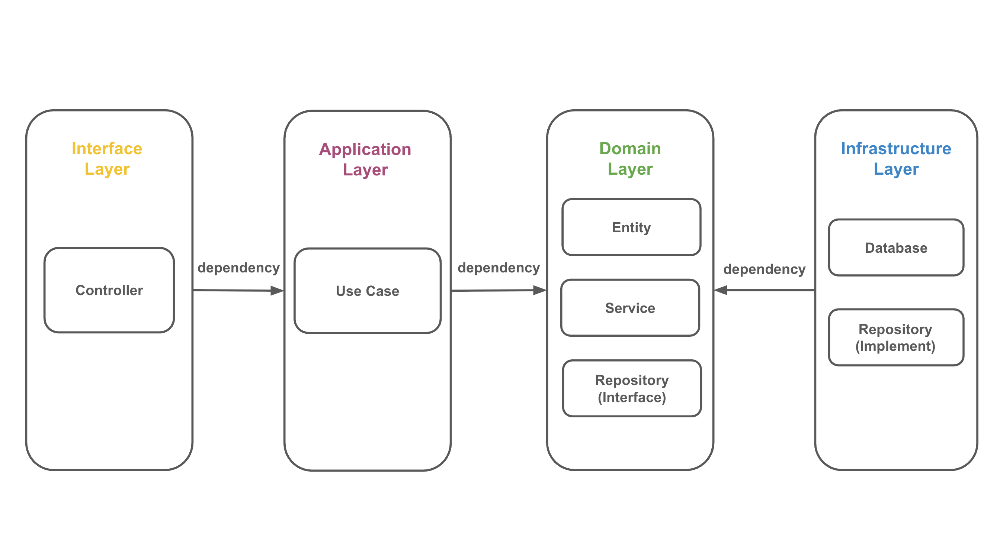
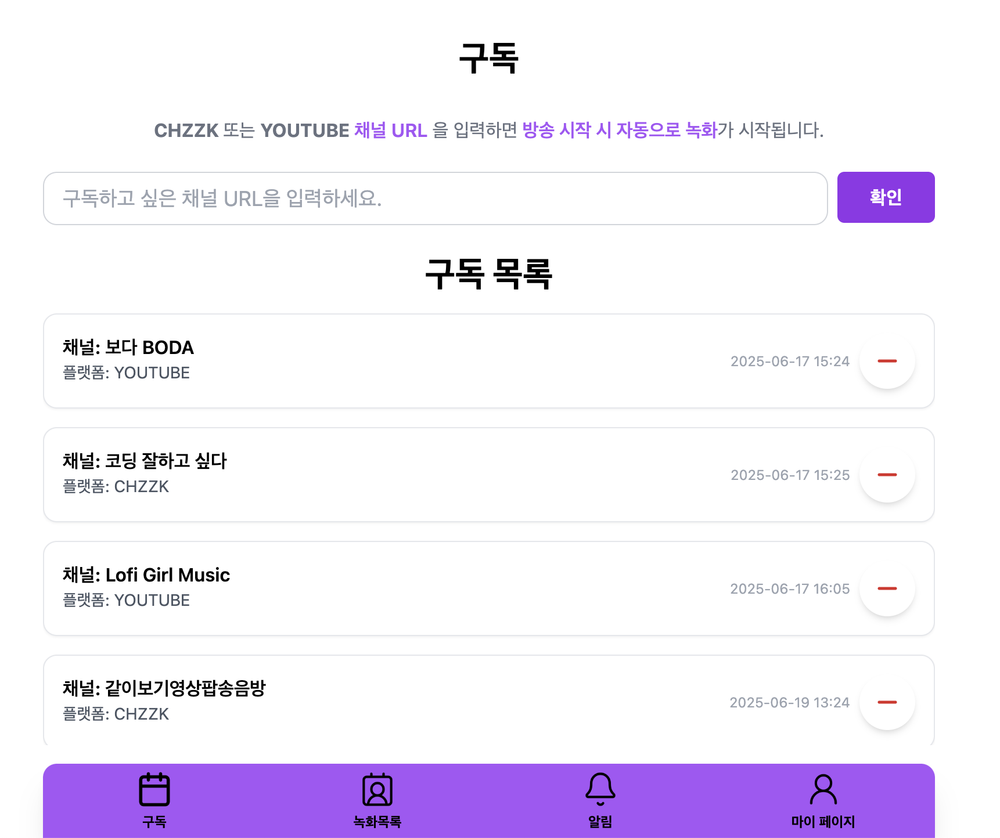
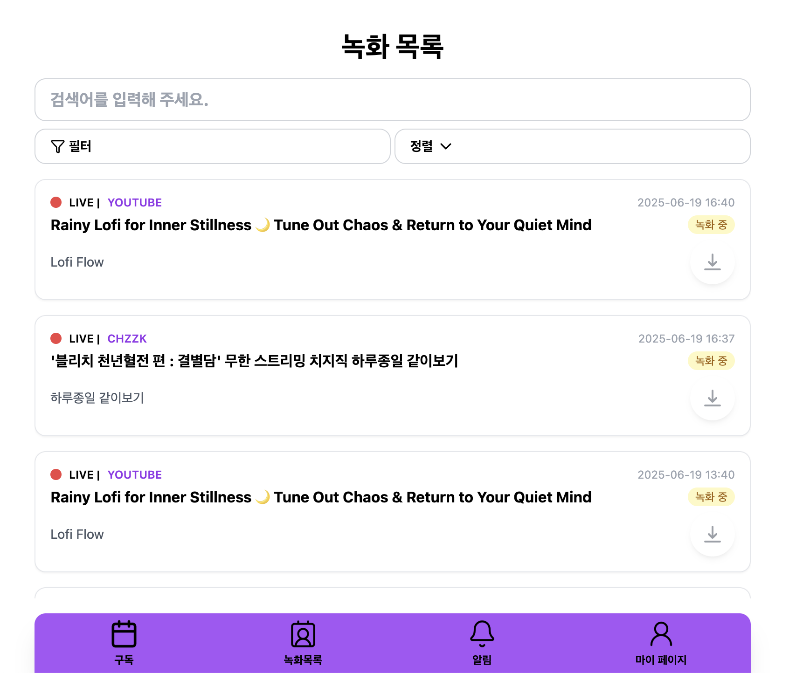
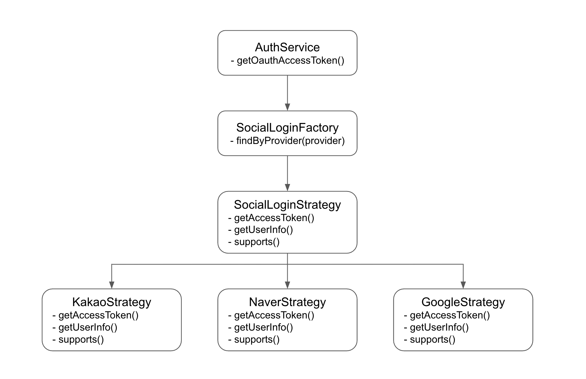
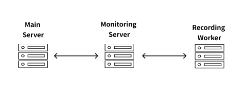
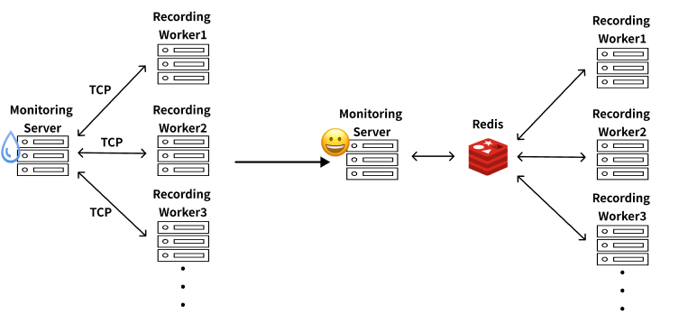

# 실시간 스트리밍 녹화 프로젝트

**“실시간 방송, 놓치지 말고 CatchLive 하세요!”
<br />
“당신의 스트리머의 스트리밍 순간을 자동으로 캐치해드립니다.”**

<br />

---

## 📖 목차

1. [프로젝트 개요](#1-프로젝트-개요)
2. [프로젝트 동기](#2-프로젝트-동기)
3. [레포지터리 역할](#3-레포지터리-역할)
4. [핵심 기능](#4-핵심-기능)
5. [기술 스택](#5-기술-스택)
6. [개발 중 고민과 해결](#6-개발-중-고민과-해결)
7. [멤버 소개](#7-멤버-소개)
8. [회고](#8-회고)

---

## 1. 프로젝트 개요

<br />

- **프로젝트명**: CatchLive
- **기간**: 2025.5.26 ~ 2025.6.20 (기획 1주 / 개발 및 배포 4주)
- **목적**: 실시간 라이브 스트리밍 녹화를 위한 프로젝트
- **대상 사용자**: 라이브 스트리밍 방송 시간에 약속이 있어서 보지 못하는 사람들

<br />

---

## 2. 프로젝트 동기

<br />

실시간 라이브 스트리밍은 점점 더 많은 콘텐츠가 생성되고 소비되는 핵심 플랫폼이 되고 있습니다. 하지만 플랫폼 자체에서 라이브 방송을 다시 보기 기능 없이 종료해버리는 경우가 많고, 사용자들이 놓친 방송을 다시 시청할 수 있는 방법은 제한적입니다.

특히 팬덤 중심의 콘텐츠 소비가 활발한 지금, 실시간 스트리밍을 놓치면 영영 볼 수 없는 아쉬움은 사용자에게 큰 불편함이 됩니다. 또한 크리에이터나 데이터 분석가 입장에서는 방송 기록을 보관하거나 후속 콘텐츠 제작에 활용할 수 있는 수단이 필요합니다.

이 프로젝트는 YouTube, 치지직(Chzzk) 등 다양한 플랫폼에서 실시간 방송이 시작되면 자동으로 감지하고, 방송 종료 시까지 안정적으로 녹화해주는 백엔드 시스템을 구현한 것입니다.

<br />

> 채널 구독 → 라이브 감지 → 녹화 시작 → S3 업로드 → 완료 알림 → 영상 다운로드까지 자동화된 파이프라인을 통해 팬, 크리에이터, 플랫폼 운영자 모두에게 유용한 스트리밍 백업 시스템을 만드는 것이 목표였습니다.

<br />

---

## 3. 레포지터리 역할

<br />

### 3.1. 레포지토리 소개

[클라이언트 레포지토리](https://github.com/Catch-Live/catch-live-app) |
[서버 레포지토리](https://github.com/Catch-Live/catch-live-api)

해당 레포지토리는 CatchLive 서비스의 서버 관련 코드를 관리하는 저장소입니다.

하나의 레포지토리 내에서 다음과 같은 세 가지 서버를 함께 운영합니다

- API 서버: 클라이언트와 통신하며 사용자 인증, 일정, 채팅, 구독 등 비즈니스 로직을 처리합니다.
- 모니터링 서버: 녹화 상태 확인, 워커 헬스체크 등 시스템의 상태를 모니터링합니다.
- 녹화 워커 서버: 실시간 방송을 백그라운드에서 녹화하고, 처리 및 저장을 담당합니다.

⸻

### 3.2. 서버 구조 및 아키텍처



기존의 **레이어드 아키텍처(Layered Architecture)** 에 **클린 아키텍처(Clean Architecture)** 사상을 적용해서 다음과 같은 4개의 주요 레이어로 구성되어 있습니다.

1. Domain 레이어
   • 서비스의 핵심 비즈니스 규칙과 도메인 모델을 정의합니다.
   • 기술 구현과 무관한 순수한 로직(엔티티, 도메인 서비스 등)을 포함합니다.
   • 저장소에 대한 접근은 직접 하지 않으며, repository interface만 정의합니다.

2. Application 레이어
   • 실제 사용자의 요청에 대한 유스케이스를 정의합니다.
   • 도메인 객체들을 조합하여 구체적인 작업 흐름을 구성합니다.
   • 트랜잭션 제어, 서비스 호출 순서 관리 등 처리 흐름을 담당합니다.

3. Interface 레이어
   • 외부와의 연결 지점으로, Controller, Module, DTO 등이 포함됩니다.
   • 클라이언트 요청을 받아 application layer의 유스케이스를 호출하고, 응답을 반환합니다.
   • 인증, 권한 체크, 요청값 검증 등의 역할도 이 레이어에서 처리합니다.

4. Infrastructure 레이어
   • 데이터베이스, 파일 시스템, 외부 API 등 외부 시스템과의 연결을 담당합니다.
   • repository interface의 실제 구현체들이 이곳에 위치합니다.
   • Prisma ORM, S3, Redis 등의 외부 도구를 사용하는 구체적인 코드가 포함됩니다.

---

## 4. 핵심 기능

### 4.1. 구독하기

<details><summary>화면</summary>
<p align="center">



</p>
</details>

- 사용자는 원하는 스트리머를 구독할 수 있습니다.(CHZZK or YOUTUBE)
  - 최대 5명까지 스트리머를 구독할 수 있습니다.
- 구독한 시점부터 스트리머가 라이브 중일 경우 자동으로 녹화가 시작됩니다.

### 4.2. 녹화 목록 & 다운로드

<details><summary>화면</summary>
  <p align="center">



  </p>
</details>

- 사용자는 현재 자신이 구독 중인 녹화 상황을 볼 수 있습니다.
- 방송이 종료된 경우, 다운로드를 통해 녹화 파일을 확인할 수 있습니다.
  - 최대 3일까지 다운로드 가능합니다.
- 검색을 통해 자신이 찾고 싶은 녹화 파일을 찾을 수 있습니다.

<br />

---

## 5. 기술 스택

### **Backend**

- **Language**: Node 18
- **Framework**: NestJS 11
- **Database**: MySQL 8.xx
- **Infrastructure**: Redis 7.x
- **ORM**: Prisma 6.8
- **Authentication**: OAuth2 + JWT

### **Infra & DevOps**

- **CI/CD**: GitHub Actions + Docker + AWS Elastic Beanstalk
- **Middleware:** AWS ElasticCache, AWS S3, AWS RDS

### 🤔 Why Nest.js?

Nest.js는 모듈 기반 아키텍처와 의존성 주입 기능, 데코레이터 기능들을 제공하는 TypeScript 중심의 Node.js 프레임워크입니다. Node.js를 기반으로 하기 때문에 빌드된 컨테이너의 크기가 작고, 런타임에 기본적으로 점유하는 리소스도 적어 신규 서비스를 제작하고 운영하는데 적합합니다.

Express.js 와 비교하여, 데코레이터와 모듈 의존성 컨트롤 등을 추가로 학습해야 되지만, 로그인, 토큰 관리 같은 널리 쓰이는 기능들을 데코레이터를 통해 쉽게 사용할 수 있고, 리소스 점유나 빌드된 컨테이너 파일등이 전체적으로 가볍기 때문에 AWS 배포에도 적합하다고 판단되어 Nest.js 를 사용하기로 했습니다.

### 🤔 Why Prisma?

Prisma는 선언형 스키마와 자동 마이그레이션, 타입 선언과 검사, 직관적 API로 개발 생산성과 안정성을 극대화하는 ORM입니다. 작성한 스키마를 통해 실제 DB에 구조를 자동 생성할 수 있으며, SQL대신 Prisma에서 제공하는 기능을 사용하여 실제로 쿼리를 요청하기 전에 에러를 감지할 수 있고, transaction 같은 기능들도 Prisma를 통해 간단하게 사용할 수 있습니다.

TypeORM도 SQL 대신 제공하는 기능들을 쓸 수 있으나, 컴파일 단계에서 타입 검사를 하지 않아 오류 검사, 수정이 번거롭고, Prisma에 비해 자동으로 제공하는 기능이 적어 개발 소요가 늘어날 수 있습니다. 그래서 좀 더 간편하게 사용할 수 있고 다양한 기능들을 제공하는 Prisma를 사용하기로 했습니다.

### 🤔 Why MySQL?

MySQL은 오픈 소스 기반의 관계형 데이터베이스 관리 시스템으로, 안정적이고 효율적으로 대용량 데이터를 저장·관리할 수 있습니다. 데이터의 타입을 정의하여 잘못된 값이 기록될 상황을 방지할 수 있으며, 트랜잭션의 주요 속성인 ACID를 준수합니다. AWS를 비롯한 많은 클라우드플랫폼에서 MySQL을 지원하기 때문에 다양한 상황, 환경에서도 안정적으로 사용할 수 있습니다.

MongoDB등을 포함한 NoSQL은 유연한 데이터 구조를 가질 수 있으나, 현재 개발 프로젝트는 명확한 데이터 구조를 가지고 있고, 이를 자동으로 엄격하게 관리해야 하기 때문에 관계형 데이터베이스를 사용하기로 했습니다.

### 🤔 Why Redis?

Redis는 메모리 기반의 고성능 키-값 데이터 저장소로, 사용자와 서버, 서버와 서버 사이에서 임시로 사용하는 데이터들을 관리하는데 사용합니다. 문자열(string), 리스트(list), 집합(set), 정렬된 집합(sorted set), 해시(hash) 등 다양한 데이터 구조를 메모리에서 직접 지원해 복잡한 캐시·큐를 손쉽게 구현할 수 있습니다. 또한 Pub/Sub과 Streams 기능을 활용해 실시간 메시징, 이벤트 기반 처리, 작업 파이프라인 기능을 통해 분산 시스템을 지원할 수 있습니다

현재 개발 프로젝트에서는 녹화 작업을 수행하는 분산 시스템을 지원할 기능들이 필요하여 Redis를 사용하기로 했습니다.

---

## 6. 개발 중 고민과 해결

### 6.1. 오버스크롤링 해결

#### 상황

알림이나 상태 목록들을 일정 범위 안에다 작성하고, 이를 스크롤해서 볼 수 있도록 계획하고 개발을 시작했습니다.

#### 문제

그러나 상태 목록들이 일정 범위 밖을 벗어나서 하단 네비게이션 바를 밀어내거나, 범위 바깥으로 계속 작성되고, 스크롤 바도 계획 외의 부모 컨테이너에 적용되어 목록 외 컨테이너들도 같이 스크롤되는 증상이 발생했습니다.

#### 해결

`width` 나 `height`의 `min`, `max`등을 지정하지 않으면 디폴트 설정인 `auto`가 되고,
대부분의 경우, `width`, `height` 를 다음과 같은 공식으로 계산합니다.

```ts
'width' + '좌우 margin' + '좌우 border' + '좌우 padding' = block의 전체 width
```

[출처](https://www.w3.org/TR/CSS2/visudet.html#min-max-heights)

스크롤 대상인 자식 컨테이너들부터 최상단까지, 어느 하나라도 `auto` 값으로 설정되어있다면
본인의 크기를 자식 컨테이너의 크기를 구한 다음 그 값에 맞추기 때문에 의도치 않은 부모 컨테이너에 스크롤이 적용되거나, 다른 컨텐츠들이 화면 밖으로 밀려날 수 있습니다.

따라서 자식 컨테이너부터 최상단 부모 컨테이너까지, `auto` 설정이 되지 않도록 `min-h-0` 같은 옵션들을 작성해야 의도한 대로 일정 범위안에 자식 컨테이너들이 있고, 스크롤해서 모든 자식 컨테이너를 볼 수 있도록 할 수 있습니다.

#### 회고

생각지도 못한 CSS 문제였기에 꽤 오랜 시간이 소요됐습니다. `auto` 는 자식 컨테이너의 값을 먼저 구하고, 그 값에 맞춰서 부모의 값을 구한다는것을 명심해야겠다고 생각했습니다.

### 6.2. 타입스크립트의 타입추론 실패 문제

#### 상황

이전에 작성된 `useInfinityQuery`를 별도록 템플릿화 시켜서, `useInfinityQuery` 를 재작성할 필요 없이, 정해진 템플릿대로 입력하면 동작하도록 구현하고있었습니다.

#### 문제

리턴값의 타입 추론에 실패하여 계속 타입스크립트 오류가 발생하였습니다.

#### 해결

이전에 작성된 코드에서 고정된 옵션 값을 추가로 입력받을수 있도록 `...options` 를 추가하였는데, 이렇게 옵션값이 고정이 아닌 변수가 되면 리턴값을 타입 추론하는데 실패하는것으로 보입니다. 따라서 이전에는 자동으로 `InfiniteData<T, number | null>`로 변환해서 별 문제없이 실행된 리턴 타입 `T` 를 `InfiniteData<T, number | null>`로 선언하여 올바른 리턴값 타입을 추론하도록 수정하였습니다.

#### 회고

옵션값이 고정이었을때 자동으로 타입을 변환하여 리턴하길래 자동으로 타입을 변환해주는 기능이 라이브러리에 있다고 생각하여 오랜시간 다른 방향에서 문제의 원인을 찾았습니다. 문제의 원인을 추론할때 좀 더 오픈 마인드로 가설을 세울 필요가 있다고 생각했습니다.

<br />

### 6.3. 소셜 로그인 구현에서의 전략 패턴 적용

소셜 로그인 기능을 구현하면서 가장 고민했던 부분은 카카오, 네이버, 구글처럼 서로 다른 플랫폼의 인증 방식과 응답 포맷을 어떻게 일관되게 처리할 것인가였습니다.

<br />

#### 🤔 초기에 겪은 문제

처음에는 인증 로직을 하나의 서비스(AuthService) 안에 모두 작성했습니다.
플랫폼에 따라 if 문으로 인증 흐름을 분기했는데, 이 방식은 당장은 동작했지만 점점 구조가 무거워졌습니다.

각 플랫폼마다 인가 코드 요청, 토큰 발급, 사용자 정보 조회 흐름은 유사했지만, 세부 파라미터나 API 엔드포인트, 응답 포맷이 달라 비슷한 로직이 반복되었고, 그로 인해 하나의 파일 내 코드량이 많아지면서 가독성이 점점 떨어지는 문제가 발생했습니다.

또한 새로운 소셜 로그인 방식을 추가할 때마다 기존 코드에 손을 대야 했고, 이는 향후 확장성과 안정성 모두에 좋지 않다고 판단했습니다.

<br />

#### ✅ 전략 패턴 도입을 통한 구조 개선



이 문제를 해결하기 위해 전략 패턴(Strategy Pattern) 을 도입했습니다.
핵심 아이디어는 플랫폼별 인증 로직을 각각의 전략 클래스로 분리하고, 이들을 공통된 인터페이스로 묶어 일관된 방식으로 실행할 수 있는 구조를 만드는 것이었습니다.

먼저, 카카오, 네이버, 구글 등 각 소셜 로그인 플랫폼에 대해 별도의 전략 클래스를 만들었습니다.
각 전략 클래스는 해당 플랫폼에 특화된 인가 코드 처리, 토큰 발급, 사용자 정보 조회 로직만을 책임지며, 모두 공통된 메서드 구조를 따릅니다.

그다음, 전략 객체를 선택하고 실행하는 팩토리 클래스를 구성하여, 소셜 로그인 요청이 들어올 때 어떤 플랫폼인지에 따라 적절한 전략을 찾아 실행하도록 했습니다.
즉, 인증 흐름의 진입점에서는 “어떤 전략을 사용할지” 결정만 하고, 실제 인증 로직은 전략 클래스에 역할을 위임하는 구조로 바뀐 것입니다.

이러한 구조 덕분에, 도메인 서비스 계층(AuthService)에서는 카카오든 네이버든 구글이든 상관없이, 단순히 `getAccessToken`, `getUserInfo` 같은 공통 메서드를 호출하기만 하면 됩니다.
플랫폼의 세부 구현을 몰라도 동일한 방식으로 로직을 처리할 수 있게 되었고, 로직의 추상화 수준이 높아져 가독성과 유지보수성이 대폭 향상되었습니다.

#### 도입 후 얻은 효과

전략 패턴을 도입한 뒤로 다음과 같은 장점이 있었습니다

- 인증 로직이 각 전략 클래스에 명확하게 분리되어 있어, 코드를 이해하고 유지보수하기 훨씬 쉬워졌습니다.
- 새로운 소셜 로그인 플랫폼을 추가할 때는, 기존 로직을 수정하지 않고 전략 클래스를 새로 추가하고 등록만 하면 되므로 확장성이 뛰어났습니다.
- 인증 흐름이 표준화되면서 테스트 작성이 쉬워지고, 플랫폼별 문제를 전략 단위로 독립적으로 디버깅할 수 있었습니다.
- 결과적으로 OCP(개방-폐쇄 원칙) 을 충실히 지키는 구조가 되어, 이후에도 안정적으로 기능을 확장해 나갈 수 있는 기반을 마련할 수 있었습니다.

<br />

---

<br />

### 6.4. 메인 서버로부터 워커 분리



**상황**

- 사용자가 원하는 스트리머를 구독하면, 해당 스트리머가 실시간 방송을 시작할 때 자동으로 녹화를 수행하는 시스템
  - 구독 → 실시간 스트리머가 라이브 중인지 주기적으로 확인 → 녹화 진행

**문제**

- 단일 서버 구조에서는 다음과 같은 문제가 발생가능
  - 확장성 부족: 스트리머가 많아질수록 각 스트리밍 플랫폼에 대해 주기적인 Live 상태 체크, 녹화 처리, 후처리 등이 한 서버에 집중되어 병목이 발생
  - 불안정한 프로세스 관리: 녹화 중인 스트리밍의 중단이나 오류 발생 시 자동 복구가 어려움

**해결**

- 시스템을 아래와 같이 역할 분리 및 분산 처리 구조로 재설계
  - Main Server: 유저 구독 관리, 녹화 요청/결과 확인 및 영상 다운로드, 알림, 마이 페이지
  - Monitoring Server: 각 플랫폼의 스트리머 Live 상태를 실시간 감지, 감지 시 워커에게 녹화 요청 전송
  - Recording Worker: 각 워커는 독립적으로 Streamlink 기반 녹화 수행, 병렬 녹화 가능, 녹화 결과를 S3에 업로드하고 DB 기록

**회고**

- 이 구조 덕분에 스트리머 수가 늘어나도 안정적으로 녹화가 가능해짐
- 단일 서버 구조였다면 불가능했던 확장성과 안정성을 확보할 수 있었고, 실제 운영 중인 시스템에서도 장애 격리, 병렬성, 장애 복구의 이점이 명확해짐

<br/>

### 6.5. Redis로 히트비트 및 상태관리 이관



**상황**

- 모니터링 서버는 라이브 방송을 감지하고, 워커는 녹화 프로세스를 실행하며, 이 둘은 TCP 연결을 통해 데이터를 직접 통신하고 하트비트 진행

**문제**

- 초기에는 TCP 기반의 직접 연결로 워커와 모니터링 서버 간의 상태 확인 및 Job 전달을 수행했지만, 서비스가 확장되면서 다음과 같은 문제가 발생
  - 연결 관리 부담 증가: 워커 수가 많아질수록, TCP 연결 수가 기하급수적으로 늘어나 연결 상태 유지(keep-alive)와 재연결에 대한 부담이 커짐
  - 상태 관리 책임의 불명확성: 워커가 수시로 scale-out/in 되면서 누가 어떤 워커의 상태를 추적하고 장애를 감지할지 책임 분리가 모호해짐
  - 유지보수 및 장애 대응 어려움: TCP 기반의 ping-pong 구조는 재연결 시 상태 복구나 job 복제 방지가 어렵고, 모니터링 서버가 단일 장애점(SPOF)이 될 수 있음

**해결**

- TCP 기반 상태 관리를 Redis 기반 메시지/상태 시스템으로 완전히 이관하고, 모든 Job 전달, 하트비트, 상태 추적을 Redis 키 중심으로 설계
  <br/>

| **키 이름**                    | **타입**     | **역할**                                     | **TTL** |
| ------------------------------ | ------------ | -------------------------------------------- | ------- |
| `job:waiting:queue`            | List         | 모니터링 서버가 워커에게 전달할 작업 대기 큐 | 없음    |
| `job:fail:queue`               | List         | 실패한 작업 재시도 큐                        | 없음    |
| `recording:worker:<WORKER_ID>` | Set          | 해당 워커가 처리 중인 세션 ID 리스트         | 없음    |
| `job:meta`                     | Hash         | 세션 ID → 작업 정보                          | 없음    |
| `job:done:queue`               | List         | 완료된 작업 큐                               | 없음    |
| `heartbeat:worker:<WORKER_ID>` | String (TTL) | 워커 생존 확인용 키                          | 3초     |

**회고**

- Redis 기반으로 전환한 이후 시스템은 확장성, 안정성, 복구 가능성 측면에서 크게 향상
- TCP 연결 기반 방식은 소규모 시스템에는 적합했지만, 수평 확장성과 장애 복원력이 요구되는 환경에서는 구조적 한계가 드러남
- Redis 키 설계를 세분화하고 역할을 명확히 나누면서, 장애 발생 시에도 명확한 기준에 따라 워커 상태를 판단하고 재처리할 수 있게 되었음

<br/>

### 6.6. 데이터 비용 문제 해결

**상황**

- 워커는 Streamlink를 통해 `.ts` 포맷으로 영상을 저장하며, 방송이 종료될 때까지 녹화를 지속하도록 설계되어 있음

**문제**

- 장시간 방송 녹화 시간 제한 없음
  - 라이브가 수 시간 이상 지속되면 워커가 계속 녹화하여 자원 점유가 길어지고, 과도한 파일 크기가 발생
  - 스트리머가 실수로 방송을 끄지 않으면 수일간 녹화가 이어질 수 있는 구조
- 1시간당 약 1GB에 달하는 `.ts` 파일은 S3 저장 비용 및 네트워크 대역폭에 부담을 줌

**해결**

- 녹화 타임아웃 제한 도입
  - 녹화 로직에 6시간 제한 로직을 추가해, 장시간 방송 녹화를 자동으로 종료하도록 개선
- .mp4 변환 및 용량 압축 추가
  - 녹화 완료 후 `ffmpeg`를 활용해 `.ts` → `.mp4` 재인코딩 과정 추가
  - 최대 용량 50% 절감

**회고**

- 데이터 전송 및 저장 비용을 줄이기 위해 mp4 압축 과정을 도입한 것은 실질적인 비용 절감
  - 다만, CPU 자원을 많이 소모하는 인코딩 작업을 워커가 직접 수행할 경우, 녹화 성능 저하나 지연이 발생할 수 있어 별도 서버로 분리하는 구조의 필요성 느낌
- 타임아웃 기반 녹화 종료를 통해 시스템 안정성을 높이고, 장애나 사용자 실수로 인한 장기 리소스 점유를 효과적으로 방지

---

## 7. 멤버 소개

| **Name** | **E-Mail**                                                    | **GitHub**                      |
| -------- | ------------------------------------------------------------- | ------------------------------- |
| 박경태   | [gtpark1014@gmail.com](mailto:gtpark1014@gmail.com)           | https://github.com/smileboy0014 |
| 이승민   | [leeseungmin9002@gmail.com](mailto:leeseungmin9002@gmail.com) | https://github.com/leesm0218    |
| 이현수   | [hyeonsoolee7001@gmail.com](mailto:hyeonsoolee7001@gmail.com) | https://github.com/soo96        |

<br />

---

## 8. 회고

<details><summary>박경태</summary>
순간순간은 길게 느껴졌지만, 지나고 보니 한 달은 참 짧은 시간이었습니다.
치열하게 고민하고 토론하며 결과물을 만들어가는 과정은 결코 쉽지 않았지만, 인풋 이상의 아웃풋이 있었던 값진 시간이었다고 생각합니다.
프로젝트 아이디어 선정부터 Git 전략, 커밋 및 이슈 템플릿, 코드 컨벤션, 기술 스택까지—
무엇 하나 이유 없이 정한 것은 없었습니다.
이 경험을 바탕으로, 앞으로 어떤 환경에서 누구와 작업하더라도 그때의 고민과 선택을 기억하며 최선의 결과를 낼 수 있을 것이라 믿습니다.

<br/>

**좋았던 점**: 설계부터 배포까지 서비스 개발의 전체 사이클을 직접 경험해볼 수 있었던 점이 가장 좋았습니다.
단순히 기술을 선택하는 데 그치지 않고, 합당한 이유를 바탕으로 합리적인 결정을 내리는 사고 방식을 배울 수 있었던 것도 큰 수확이었습니다.
또한, 코드 리뷰를 통해 서로의 생각을 공유하고 토론하는 과정을 통해 팀 개발의 진정한 의미를 체감할 수 있었던 시간이었습니다.
<br/>

**아쉬웠던 점**: 한 달이라는 짧은 기간 안에 프로젝트 기획부터 배포까지 모든 과정을 수행하는 것은 쉽지 않았습니다.
특히 의견 충돌이 있었을 때, 조금 더 우아하게 조율하고 설득했다면 불필요한 시간 소모를 줄일 수 있었을 것이라는 아쉬움이 남습니다.
앞으로는 의견 차이가 생기면 명확한 근거와 자료를 함께 준비해 대화하는 방식을 통해 더욱 생산적인 논의를 이끌어보고 싶습니다.
<br/>

**보완할 점**: 피드백 시간에 받은 의견들을 반영해,
예를 들어 검색 기능 개선이나
녹화 중 스트리머의 구독자가 아무도 없을 경우 자동으로 녹화를 종료하는 기능 등을 보완하면
서비스 완성도를 한층 더 높일 수 있을 것이라 생각합니다.

</details>

<details><summary>이승민</summary>
아이디어 발굴 기간이 포함된 개발기간은 정말 짧다는것을 느꼈습니다.
NodeJs로 간단한 프로그래밍만 했었기에 백엔드의 레이어드 아키텍쳐에 모듈화와 클린 아키텍쳐에 익숙하지 않아서 더더욱 짧은 시간이었던것 같습니다.
이러한 경험이 좀 더 나은 실력의 밑바탕이 되도록 더욱 노력하겠습니다.

<br/>

**좋았던점**: 팀원분들의 코드 노하우와 생각을 리뷰를 통해 볼 수 있었습니다.
의견이 엇갈리더라도 서로 나름의 근거를 제시하면서 토론했던것도 좋았습니다.
<br/>

**아쉬웠던점**: 예상보다 개발 속도가 더뎌져서 다른 팀원분들과 결과물의 개선 방향을 놓고 서로 이야기를 해보고 싶었는데 그러지 못해 아쉬웠습니다.
<br/>

**보완할점**: 미리 계획한 개발계획과 설계는 막상 개발이 시작되니 따라가기에 급급했고, 오류에 대한 정보를 찾기 힘들어 예상보다 기간이 많이 소요되었습니다. 앞으로 설계할때 참고하여 계획을 수립하거나, 이러한 상황에 대처하는 노하우가 있는지 알아봐야 되겠습니다.

</details>

<details><summary>이현수</summary>
이번 프로젝트를 통해 설계부터 개발, 배포까지의 전 과정을 팀원들과 함께 경험할 수 있었습니다.
기획 단계부터 어떤 구조로 애플리케이션을 설계할지 고민하고, 이를 실제 코드로 구현하며, 마지막에는 배포까지 책임지는 과정을 팀 단위로 수행했다는 점에서 실무에 가까운 경험을 쌓을 수 있었습니다.

<br/>

**좋았던 점** : 기능을 하나하나 개발해나가는 과정에서 모든 의사결정을 팀원들과 함께 논의하고 합의해 나갔다는 점이 좋았습니다.
어떤 방향이 더 나은 선택일지 끊임없이 대화하며 결정했고, 예상치 못한 문제가 발생했을 때도 각자 해결책을 제안하고 함께 고민하며 풀어가는 팀워크가 프로젝트의 큰 원동력이 되었습니다.
<br/>

**아쉬웠던 점** : 초기에 소셜 로그인 기능을 카카오, 네이버, 구글 세 가지 모두 구현하려다 보니, 예상보다 많은 리소스가 초반에 집중되었습니다.
각 플랫폼마다 인증 방식이 달라 구현 난이도와 테스트 부담이 컸고, 이로 인해 핵심 기능 개발이 지연되는 결과로 이어졌습니다.
돌이켜보면 처음부터 모든 플랫폼을 구현하기보다는 한 가지(예: 카카오)만 우선 도입하고, 주요 기능 개발에 집중했으면 프로젝트의 전반적인 완성도와 일정 측면에서 더 나은 결과를 얻을 수 있었을 것이라 아쉬움이 남습니다.
<br/>

**보완할 점** : 이번 경험을 통해 기능별 중요도와 난이도, 사용자 영향도를 고려한 작업 우선순위 설정의 필요성을 느꼈습니다.
앞으로는 초기 설계 단계에서 전체 로드맵을 유연하게 설계하고, 꼭 필요한 기능부터 우선 구현하여 점진적으로 확장해나가는 전략을 적용하려 합니다.
이를 통해 한정된 시간과 자원을 보다 효율적으로 사용할 수 있도록 개선해나갈 계획입니다.

</details>
<br />
